# AE2: Aplicación de gestión de contactos con Java Swing
Desarrollo de Interfaces.

Realizada por:
Alberto Arroyo Santofimia

**Aplicación de contactos con Java Swing**

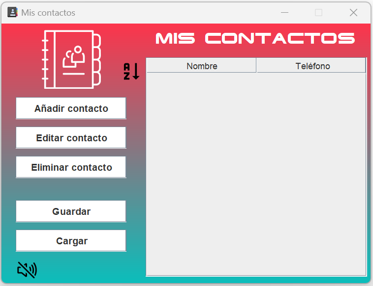
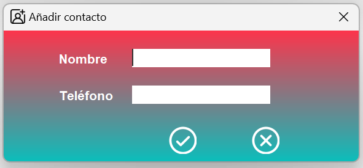

La aplicación tiene un background gradiente que pasa entre dos colores

Se ha cambiado el nombre y el icono que aparece en la aplicación y la
barra de tareas de Windows

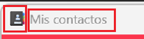

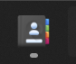

He añadido una fuente externa para poner el titulas de los contactos

Iconos vectoriales usando svg importando la librería externa FlatLaf
library

<https://github.com/JFormDesigner/FlatLaf>

Podemos poner la aplicación son sonido o sin sonido pulsando sobre la
imagen, se cambiará automáticamente y desactiva o activa el sonido según
corresponda

Se ha cambiado el fondo de los botones a blanco, quitado el sombreado y
cambiada la fuente original.

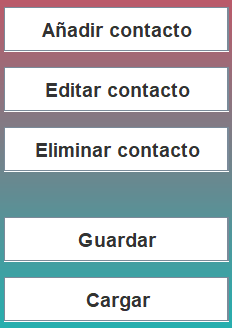

Al posicionarse sobre los botones se sombreará a gris y cambiará el
cursor del ratón

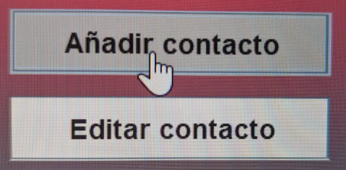

Y sobre los iconos de ordenar alfabéticamente y sonido, que son imágenes
svg al posicionarse sobre ellos hago que aparezca el fondo del botón
para que se note que son botones tambien y cambio el cursor del ratón.

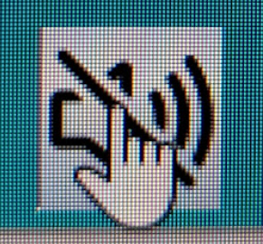

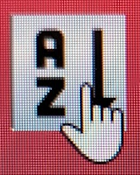

**1º Opción añadir contacto**

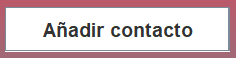

Desplegara la ventana secundaria

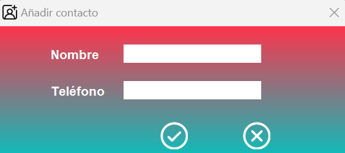

Respecto a la ventana principal se cambia el icono y el nombre

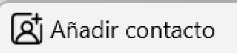

Botones de ok y cancel reemplazados por imágenes svg

En el campo nombre solo se acepta el abecedario, vocales con acento y el
espacio, si no, no se consume nada en la caja, lo he bloqueado

Y en la caja del teléfono solo se aceptan 9 números, no se pueden meter
más, todos los números españoles tienen 9 dígitos

Como requisito, ninguno de los dos campos puede estar vacío para poder
añadirse a la agenda de contactos

Si se deja el campo nombre vacío

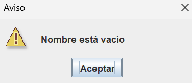

Si se deja el campo teléfono vacío

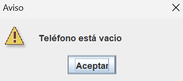

Si el teléfono no tiene nueve dígitos

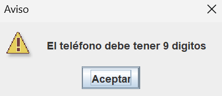

Si los dos campos están correctos en nombre se añade

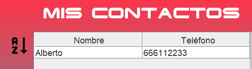

**2º Opción editar contacto**

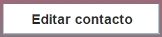

Si no seleccionamos ningún contacto a editar

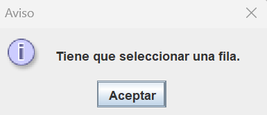

Seleccionamos el contacto a editar y pulsamos en editar contacto,
aparecen los datos del contacto.

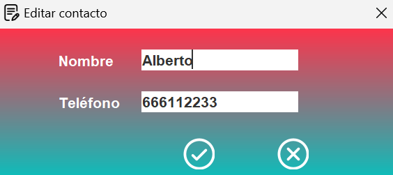

Se ha cambiado el nombre de la pestaña y el icono respecto a añadir
contacto

Si se edita el nombre y se dejan vacíos o el teléfono no tiene nueve
dígitos saltan los mismos avisos que al añadir contacto

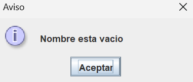

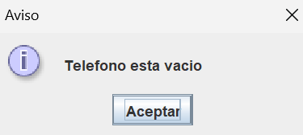

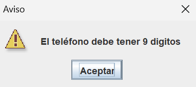

**3º Opción eliminar contacto**

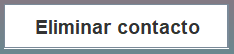

Si no se selecciona contacto a eliminar

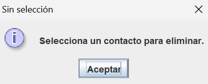

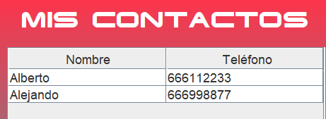

Elimino contacto Alberto

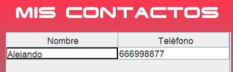

**4º Opción guardar**

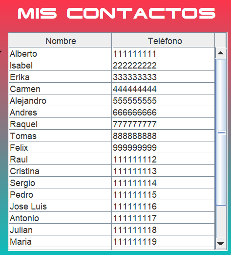

Cuando tenemos los contactos en la agenda le damos a guardar, utilicé
JFileChooser Java Swing y lo guardo en un txt.

Cambia el título de la ventana

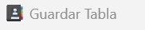

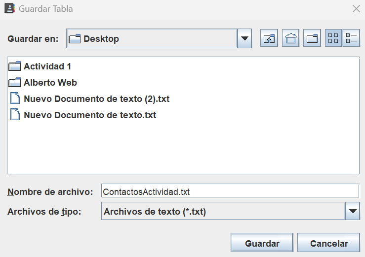

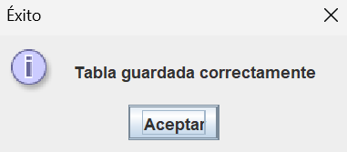

**5º Opción cargar**

Utilicé JFileChooser Java Swing

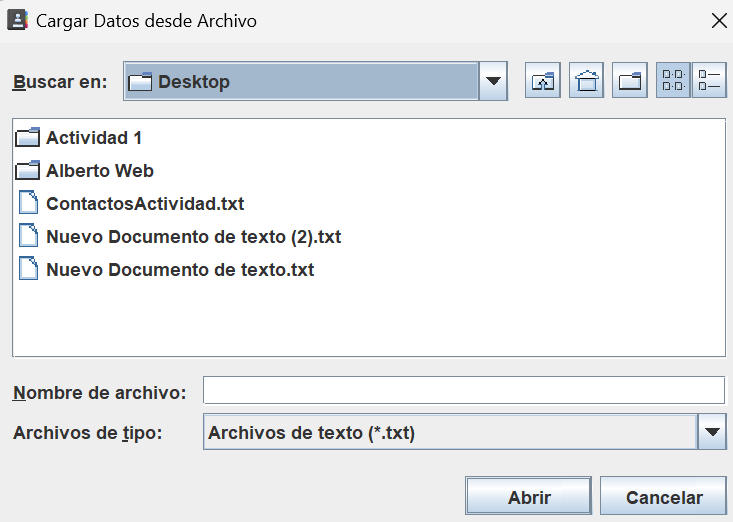

Se cambia el título de la ventana

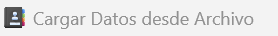

Selecciono el archivo creado anteriormente

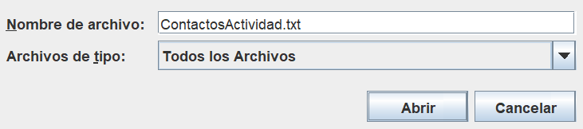

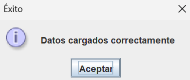

Aparecen los datos en la tabla

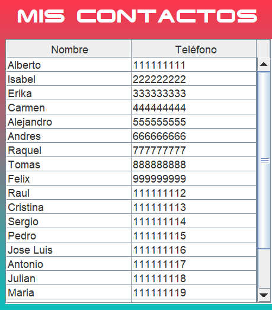

**5º Opción ordenar tabla alfabéticamente**

Hacer clic sobre el icono y se ordenan alfabéticamente

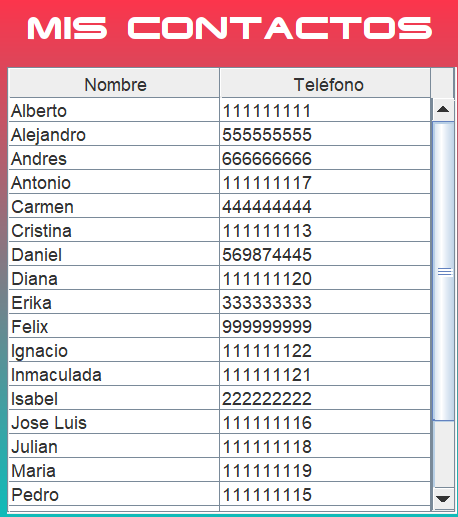
